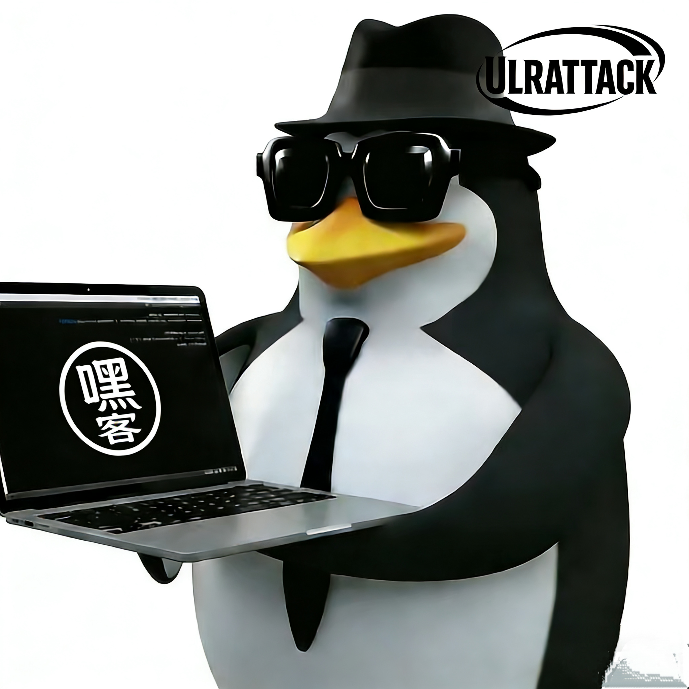
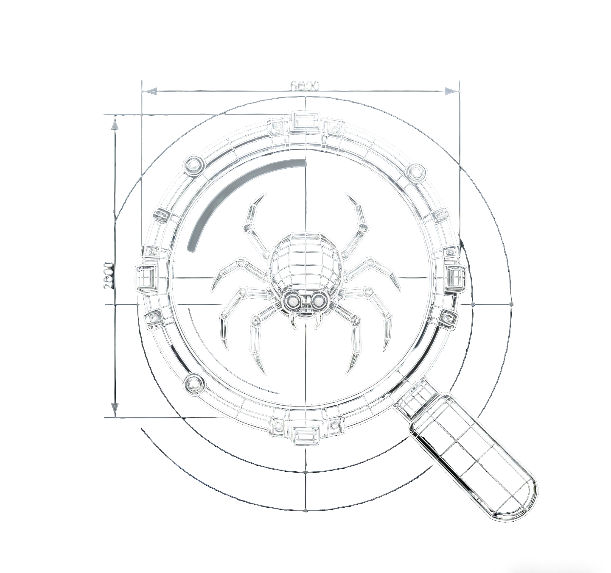

<div align="center">



# ULRATTACK（发作）

**下一代 AI 自动化黑客与安全评估平台**

[](https://github.com/giaoimgiao/heike-Ulrattack)
[](LICENSE)
[](https://www.python.org/)
[](https://www.docker.com/)

</div>

---

## 项目简介

ULRATTACK 是一个集成了多种高级 AI Agent 的自动化安全评估平台。它不仅仅是一个扫描器，更是一个能够像真实黑客一样思考、规划和执行任务的智能系统。通过 Docker 容器化沙箱环境，ULRATTACK 能够安全地执行从侦察、漏洞扫描、漏洞利用到后渗透攻击的全流程操作。


---
<div align="center">

## 🔥 [点击加入项目群聊](https://qm.qq.com/q/363ONrpeWk) 🔥
### QQ 群：875239673

---
## 核心模式

ULRATTACK 提供三种核心 Agent 模式，满足全方位的安全测试需求。

### 渗透测试 (Penetration Test)


传统的自动化渗透测试模式。系统自动进行侦察、攻击面映射和漏洞扫描。
- **功能**: 自动侦察、攻击面映射、漏洞扫描、多 Agent 协同验证。
- **输出**: 生成包含 CVSS 评分的专业漏洞报告。

### 攻击测试 (Attack Test)


基于已发现漏洞的深度利用模式。
- **功能**: 全方位漏洞利用（SQLi, RCE, SSRF 等）、后渗透攻击（权限提升、横向移动）。
- **自动化**: 自动生成可复用的 Python 攻击脚本 (`attack_toolkit.py`) 和 Payload。
- **保存位置**: `/workspace/ulrattack_runs/`

### 网络爬虫 (Network Crawler)



智能化的网络数据采集与分析模式，专为 AI 时代设计。
- **功能**: 智能网站结构分析、Cookie/会话分析（针对 LLM 和 AI 生图服务）、API 端点发现。
- **自动化**: 自动生成可直接运行的 Python 访问代码 (`access_client.py`)。
- **保存位置**: `/workspace/ulrattack_runs/`

---

## 快速开始

### 前提条件

运行 ULRATTACK 需要以下环境：

*   **Docker Desktop** (必须运行中)
    *   [下载 Docker Desktop](https://www.docker.com/products/docker-desktop/)
*   **Python 3.10+**
    *   [下载 Python](https://www.python.org/downloads/)
*   **LLM API 密钥**
    *   支持 OpenAI, DeepSeek, Anthropic, Gemini 等。

### 安装与启动

1.  **克隆仓库**

    ```bash
    git clone https://github.com/giaoimgiao/heike-Ulrattack.git
    cd heike-Ulrattack
    ```

2.  **安装依赖**

    ```bash
    pip install poetry
    poetry install
    ```

3.  **启动 Web 界面**

    Windows 用户双击运行：
    ```
    启动ULRATTACKWeb.bat
    ```

    或使用命令行：
    ```bash
    python -m ulrattack.interface.web_server
    ```

4.  **访问**
    
    打开浏览器访问 `http://localhost:8000`

---

## 输出目录说明

所有的运行结果都会自动保存到 `ulrattack_runs` 目录中：

```
ulrattack_runs/
├── <运行ID>/
│   ├── attack_report.md        # 攻击/渗透报告
│   ├── attack_toolkit.py       # (攻击模式) 自动化攻击工具包
│   ├── access_client.py        # (爬虫模式) 自动生成的访问代码
│   ├── cookies.json            # (爬虫模式) 提取的 Cookie 信息
│   ├── exploits/               # 生成的漏洞利用脚本
│   └── payloads/               # 生成的 Payload 文件
```

---


## 免责声明

本工具仅用于**授权的**安全测试、红队演练和教育目的。在使用 ULRATTACK 对任何目标进行扫描或攻击之前，请务必确保您已获得所有者的明确书面许可。使用者需自行承担因使用本工具而产生的所有法律责任。

---

## 特别鸣谢

本项目基于众多优秀的开源项目开发
我们在此基础上进行了架构重构和功能扩展，集成了新的攻击与爬虫模块。

感谢以下开源项目的贡献：
*   [Strix](https://github.com/usestrix/strix): 核心 Agent 架构参考。
*   **LiteLLM**: 多模型支持。
*   **Playwright**: 浏览器自动化。
*   **Nuclei**: 漏洞扫描引擎。
